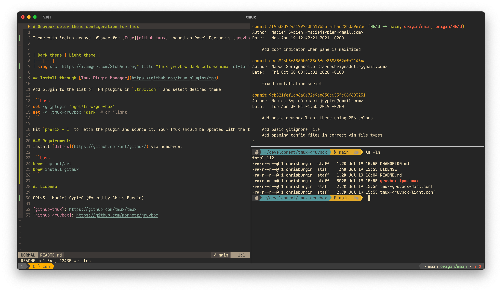

# Gruvbox color theme configuration for Tmux



## Install through [Tmux Plugin Manager](https://github.com/tmux-plugins/tpm)

Add plugin to the list of TPM plugins in `.tmux.conf` and select desired theme

```bash
set -g @plugin 'egel/tmux-gruvbox'
set -g @tmux-gruvbox 'dark' # or 'light'
```

Hit `prefix + I` to fetch the plugin and source it. Your Tmux should be updated with the theme at this point.

### Requirements
Install [Gitmux](https://github.com/arl/gitmux/) via homebrew.

```bash
brew tap arl/arl
brew install gitmux
```

## License

GPLv3 - Maciej Sypień (forked by Chris Burgin)
